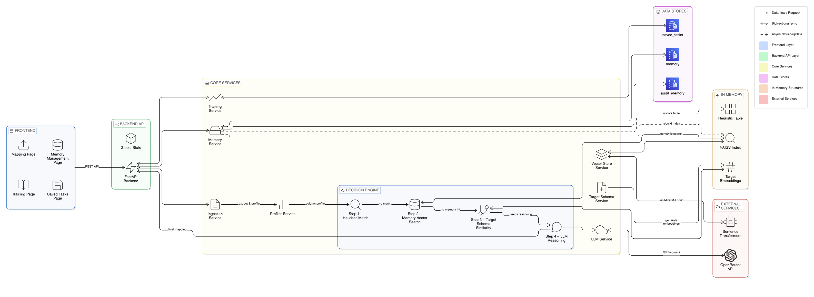

## System Architecture

### Architecture Diagram




### Architecture Overview

The system follows a layered architecture with clear separation between frontend, backend API, core services, data stores, and external services. The mapping decision process uses a **4-step pipeline** that progressively refines column-to-field mappings using heuristics, semantic search, and LLM reasoning.

---

### Component Explanations

#### **1. Frontend Layer** (Blue)

The frontend is a single-page application built with vanilla HTML, CSS, and JavaScript. It provides four main interfaces:

- **Mapping Page**
  - **Purpose**: Primary interface for CSV upload and mapping generation
  - **Functionality**: 
    - Accepts tenant name and CSV file upload
    - Displays generated mappings with confidence scores
    - Provides review interface with approve/reject/correct actions
    - Enables task saving and final mapping download
  - **User Flow**: Upload → Review → Approve/Correct → Download

- **Memory Management Page**
  - **Purpose**: CRUD operations for mapping memory records
  - **Functionality**:
    - View active/disabled memory records
    - Create, edit, or delete mappings
    - Queue pending changes before bulk commit
    - Filter by status (ACTIVE/DISABLED)
  - **Data Flow**: Changes queued → Bulk commit → MongoDB update → Index rebuild

- **Saved Tasks Page**
  - **Purpose**: Persist and resume in-progress mapping reviews
  - **Functionality**:
    - Save current review state with task name
    - List all saved tasks with status
    - Resume incomplete tasks
    - Mark tasks as completed or delete them
  - **Storage**: MongoDB `saved_tasks` collection

- **Training Page**
  - **Purpose**: Bulk ingestion of pre-mapped data for system learning
  - **Functionality**:
    - Upload Excel/CSV files with source columns and target fields
    - Calculate mapping accuracy
    - Save mismatches to memory for future reference
    - Update heuristic table and FAISS index

**Communication**: All frontend pages communicate with the Backend API via REST endpoints.

---

#### **2. Backend API Layer** (Green)

- **FastAPI Backend**
  - **Technology**: FastAPI framework with Uvicorn ASGI server
  - **Purpose**: RESTful API server handling all HTTP requests
  - **Key Features**:
    - CORS middleware for cross-origin requests
    - Request validation using Pydantic models
    - Global state management (TARGETS, MEMORY_TABLE, FAISS_INDEX, TARGET_EMBEDDINGS)
    - Startup initialization sequence (schema load, memory load, index build)

- **Global State**
  - **Components**:
    - `TARGETS`: Loaded target schema fields from JSON
    - `MEMORY_TABLE`: Pandas DataFrame for fast heuristic lookups
    - `FAISS_INDEX`: In-memory vector index for semantic search
    - `TARGET_EMBEDDINGS`: Pre-computed embeddings for target fields
  - **Initialization**: Loaded at startup, rebuilt when memory changes

**API Endpoints**:
- `/upload/` - CSV file upload and preview
- `/profile/` - Column profiling
- `/map/` - Generate mappings
- `/review/*` - Review workflow (start, submit, finalize)
- `/memory/*` - Memory CRUD operations
- `/tasks/*` - Saved tasks management
- `/train/ingest/` - Training data ingestion

---

#### **3. Core Services Layer** (Yellow)

##### **Ingestion Service**
- **Purpose**: Parse and extract data from uploaded CSV files
- **Functionality**:
  - Reads CSV files and extracts sample rows
  - Validates file format and structure
  - Prepares data for profiling
- **Output**: Column names and sample data rows

##### **Profiler Service**
- **Purpose**: Analyze source columns and infer characteristics
- **Functionality**:
  - **Data Type Inference**: Detects numeric, date, boolean, string types
  - **Statistical Analysis**: 
    - Null ratio calculation
    - Uniqueness ratio (distinct values / total rows)
    - Average and maximum length for strings
  - **Output**: `ColumnProfile` objects with inferred metadata

##### **Decision Engine** (4-Step Pipeline)

The decision engine is the core intelligence of the system, using a cascading approach:

**Step 1: Heuristic Match**
- **Purpose**: Fast exact/fuzzy matching against historical mappings
- **Method**: 
  - Normalized string matching (case-insensitive, spaces → underscores)
  - RapidFuzz fuzzy matching for typos/variations
  - Direct lookup in heuristic table (pandas DataFrame)
- **Output**: If match found with high confidence → **auto-approve**; else → Step 2

**Step 2: Memory Vector Search**
- **Purpose**: Semantic similarity search using FAISS
- **Method**:
  - Converts source column to embedding using Sentence Transformers
  - Searches FAISS index for similar historical mappings
  - Returns top-K candidates with similarity scores
- **Dependencies**: 
  - FAISS Index (in-memory vector database)
  - Target Embeddings (for comparison)
- **Output**: If strong match → proceed; else → Step 3

**Step 3: Target Schema Similarity**
- **Purpose**: Compare source column against all target fields
- **Method**:
  - Embedding-based similarity between source column and target field descriptions
  - Uses pre-computed target embeddings
  - Ranks candidates by semantic similarity
- **Dependencies**:
  - Vector Store Service (embedding generation)
  - Target Schema Service (schema loading)
- **Output**: If clear winner → proceed; else → Step 4

**Step 4: LLM Reasoning**
- **Purpose**: Advanced disambiguation using large language models
- **Method**:
  - Sends column profile + top candidates to OpenRouter API
  - LLM analyzes context and selects best target field
  - Provides confidence score and explanation
- **Dependencies**:
  - LLM Service (OpenRouter API client)
  - Rate limiting and caching
- **Output**: Final mapping decision with confidence score

**Decision Classification**:
- **Auto-Approve** (confidence ≥ 0.95): Direct mapping, no review needed
- **Needs Review** (0.8 ≤ confidence < 0.95): User review required
- **Unmapped** (confidence < 0.8): No suitable target found

##### **Memory Service**
- **Purpose**: Persistent storage and retrieval of mapping history
- **Functionality**:
  - **CRUD Operations**: Create, read, update, delete memory records
  - **Status Management**: ACTIVE (used in inference) vs DISABLED (archived)
  - **Audit Trail**: All changes logged to `audit_memory` collection
  - **Heuristic Table Building**: Converts MongoDB records to pandas DataFrame for fast lookups
- **Storage**: MongoDB collections (`memory`, `audit_memory`)
- **Immutability**: Updates create new records and disable old ones

##### **Vector Store Service**
- **Purpose**: FAISS index management for semantic search
- **Functionality**:
  - **Index Building**: Converts memory records to embeddings and builds FAISS index
  - **Semantic Search**: Finds similar mappings using cosine similarity
  - **Index Rebuilding**: Updates index when memory changes
- **Technology**: FAISS (Facebook AI Similarity Search)
- **Embedding Model**: Sentence Transformers `all-MiniLM-L6-v2`

##### **Target Schema Service**
- **Purpose**: Load and manage target schema definitions
- **Functionality**:
  - Loads target fields from `target_schema.json`
  - Generates embeddings for all target fields
  - Validates required fields in mappings
  - Provides schema metadata (categories, descriptions, data types)

##### **LLM Service**
- **Purpose**: Integration with OpenRouter API for LLM calls
- **Functionality**:
  - **API Communication**: OpenAI-compatible requests to OpenRouter
  - **Rate Limiting**: 
    - Per-minute limit (default: 30 RPM)
    - Per-day limit (default: 14,400 RPD)
  - **Caching**: Response caching to reduce duplicate API calls
  - **Retry Logic**: Exponential backoff on failures
  - **Fallback**: Graceful degradation if API unavailable
- **Models Supported**: GPT-4o-mini, Gemini, Claude, etc.

##### **Training Service**
- **Purpose**: Bulk ingestion of pre-mapped training data
- **Functionality**:
  - Parses Excel/CSV files with source columns and target fields
  - Compares against current system predictions
  - Calculates accuracy metrics
  - Saves mismatches to memory for learning
  - Triggers index rebuilds after ingestion

---

#### **4. Data Stores Layer** (Purple)

##### **MongoDB Database** (`mapper_db`)

- **`memory` Collection**
  - **Purpose**: Store all mapping history records
  - **Schema**:
    - `source_column`: Source column name
    - `target_field`: Mapped target field name
    - `confidence`: Mapping confidence score
    - `status`: ACTIVE or DISABLED
    - `tenant_name`: Multi-tenant filtering
    - `category`: Field category
    - `usage_count`: How many times used
    - `memory_source`: Origin (system, human, training, manual)
  - **Query Pattern**: Only ACTIVE records used in inference

- **`audit_memory` Collection**
  - **Purpose**: Audit trail for all memory changes
  - **Functionality**: Tracks creates, updates, and deletes with timestamps
  - **Use Case**: Compliance, debugging, change history

- **`saved_tasks` Collection**
  - **Purpose**: Persist in-progress mapping reviews
  - **Schema**:
    - `task_name`: User-defined task name
    - `tenant_name`: Associated tenant
    - `mapping_data`: Serialized mapping state
    - `review_status`: SAVED or COMPLETED
    - `created_date`, `updated_date`: Timestamps

---

#### **5. In-Memory Structures Layer** (Orange)

These structures are loaded at startup and kept in memory for fast access:

- **Heuristic Table**
  - **Type**: Pandas DataFrame
  - **Purpose**: Fast exact/fuzzy matching lookups
  - **Structure**: Indexed by normalized source column names
  - **Update**: Rebuilt when memory records change
  - **Performance**: O(1) lookup time for exact matches

- **FAISS Index**
  - **Type**: FAISS vector index (IndexFlatL2)
  - **Purpose**: Semantic similarity search
  - **Structure**: 
    - Vector embeddings of memory records
    - Index-to-memory record mapping
  - **Update**: Rebuilt when memory records change
  - **Performance**: Fast approximate nearest neighbor search

- **Target Embeddings**
  - **Type**: NumPy array of embeddings
  - **Purpose**: Pre-computed embeddings for all target fields
  - **Generation**: Created at startup using Sentence Transformers
  - **Usage**: Compared against source column embeddings in Step 3

---

#### **6. External Services Layer** (Red)

##### **OpenRouter API**
- **Purpose**: LLM inference for advanced mapping decisions
- **Endpoint**: `https://openrouter.ai/api/v1/chat/completions`
- **Model**: Configurable (default: `openai/gpt-4o-mini`)
- **Authentication**: API key required
- **Features**: 
  - OpenAI-compatible interface
  - Access to multiple LLM providers
  - Rate limiting and cost management

##### **Sentence Transformers**
- **Purpose**: Generate embeddings for semantic search
- **Model**: `all-MiniLM-L6-v2` (default)
  - Lightweight, fast, 384-dimensional embeddings
  - Good balance of speed and accuracy
- **Usage**: 
  - Converts text (column names, descriptions) to vectors
  - Used for both memory records and target fields

---

### Data Flow Patterns

#### **1. Mapping Generation Flow**
```
CSV Upload → Ingestion Service → Profiler Service → Decision Engine
  → [Step 1: Heuristic] → [Step 2: Vector Search] → [Step 3: Schema Similarity] 
  → [Step 4: LLM] → Final Mapping → Frontend Review
```

#### **2. Memory Update Flow**
```
User Feedback → Memory Service → MongoDB (memory collection)
  → Rebuild Heuristic Table → Rebuild FAISS Index → Update Global State
```

#### **3. Training Flow**
```
Excel/CSV Upload → Training Service → Compare Predictions
  → Save Mismatches → Memory Service → Rebuild Indexes
```

#### **4. Task Persistence Flow**
```
Review State → Save Task → MongoDB (saved_tasks) → Resume Later
  → Restore State → Continue Review
```

---

### Key Design Decisions

1. **4-Step Cascading Pipeline**: Starts with fast heuristics, escalates to expensive LLM only when needed
2. **In-Memory Structures**: Heuristic table and FAISS index for sub-millisecond lookups
3. **Immutable Memory**: Updates create new records, preserving audit trail
4. **Multi-Tenant Support**: All mappings tagged with tenant_name for isolation
5. **Rate-Limited LLM**: Prevents API quota exhaustion with configurable limits
6. **Graceful Degradation**: System works without LLM (heuristics only) or MongoDB (in-memory only)

---